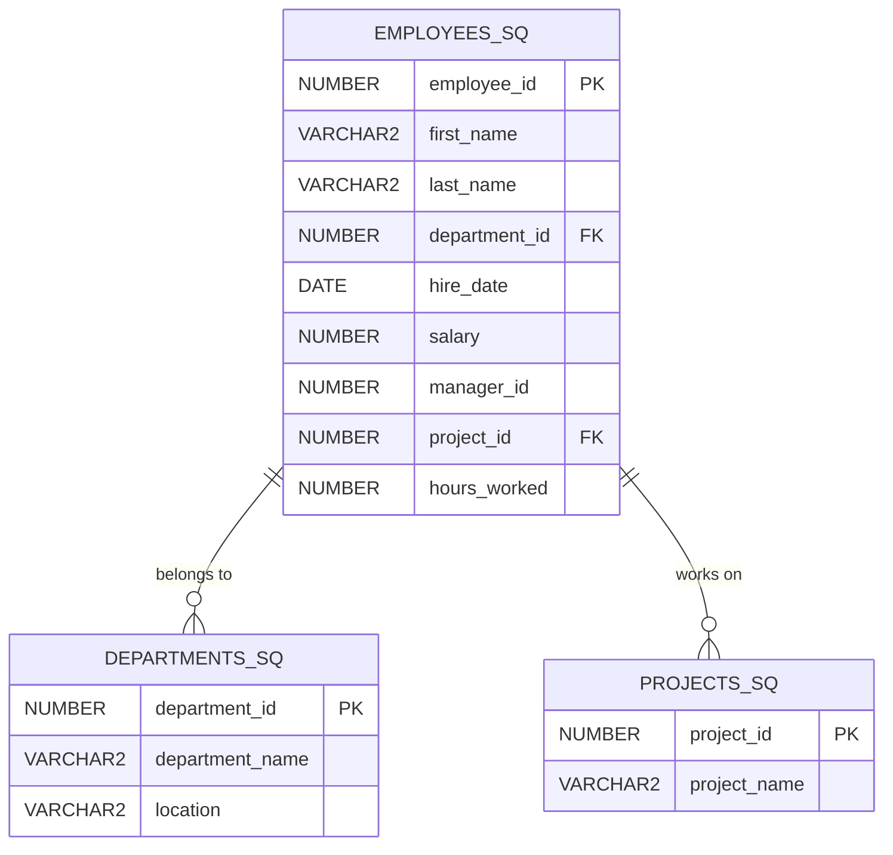

```mermaid
erDiagram
    EMPLOYEES_SQ {
        NUMBER employee_id PK
        VARCHAR2 first_name
        VARCHAR2 last_name
        NUMBER department_id FK
        DATE hire_date
        NUMBER salary
        NUMBER manager_id
    }
    DEPARTMENTS_SQ {
        NUMBER department_id PK
        VARCHAR2 department_name
        VARCHAR2 location
    }
    PROJECTS_SQ {
        NUMBER project_id PK
        VARCHAR2 project_name
    }
    EMPLOYEES_SQ {
        NUMBER project_id FK
        NUMBER hours_worked
    }
    EMPLOYEES_SQ ||--o{ DEPARTMENTS_SQ : "belongs to"
    EMPLOYEES_SQ ||--o{ PROJECTS_SQ : "works on"
```